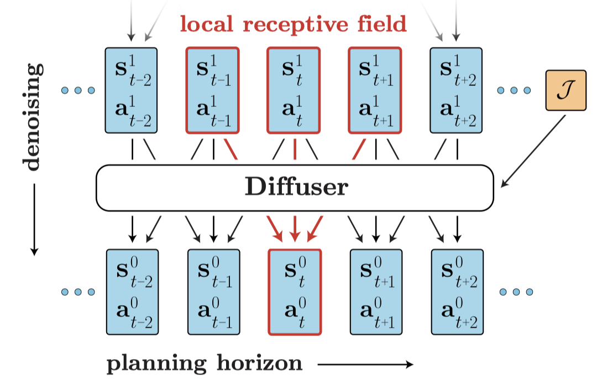
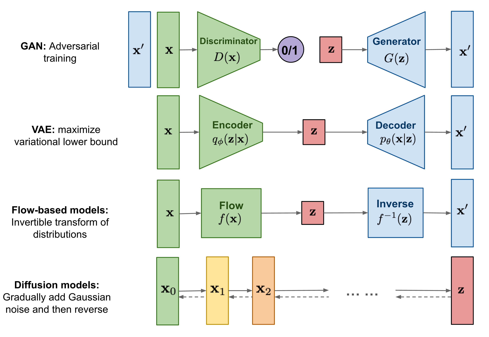

# Awesome Diffusion Model in RL

This is a collection of research papers for **Diffusion Model in RL**.
And the repository will be continuously updated to track the frontier of Diffusion RL.

Welcome to follow and star!

## Table of Contents

- [Awesome Diffusion Model in RL](#awesome-diffusion-model-in-rl)
  - [Table of Contents](#table-of-contents)
  - [Overview of Diffusion Model in RL](#overview-of-diffusion-model-in-rl)
    - [Advantage](#advantage)
  - [Papers](#papers)
    - [Arxiv](#arxiv)
    - [ICML 2023](#icml-2023)
    - [ICLR 2023](#iclr-2023)
    - [ICRA 2023](#icra-2023)
    - [Neurips 2022](#neurips-2022)
    - [ICML 2022](#icml-2022)
  - [Contributing](#contributing)
  - [License](#license)

## Overview of Diffusion Model in RL

The Diffusion Model in RL was introduced by “Planning with Diffusion for Flexible Behavior Synthesis” by Janner, Michael, et al. It casts trajectory optimization as a **diffusion probabilistic model** that plans by iteratively refining trajectories.



There is another way:  "Diffusion Policies as an Expressive Policy Class for Offline Reinforcement Learning" by Wang, Z. proposed Diffusion Model as policy-optimization in offline RL, et al. Specifically, Diffusion-QL forms policy as a conditional diffusion model with states as the condition from the offline policy-optimization perspective.



### Advantage

1. Bypass the need for bootstrapping for long term credit assignment.
2. Avoid undesirable short-sighted behaviors due to the discounting future rewards.
3. Enjoy the diffusion models widely used in language and vision, which are easy to scale and adapt to multi-modal data.

## Papers

```
format:
- [title](paper link) [links]
  - author1, author2, and author3...
  - publisher
  - key 
  - code 
  - experiment environment
```

### Arxiv

- [MADiff: Offline Multi-agent Learning with Diffusion Models](https://arxiv.org/abs/2305.17330)
  - Zhengbang Zhu, Minghuan Liu, Liyuan Mao, Bingyi Kang, Minkai Xu, Yong Yu, Stefano Ermon, Weinan Zhang
  - Key: Multi-agent, Offline RL
  - ExpEnv: MPE, SMAC, Multi-Agent Trajectory Prediction (MATP)

- [Diffusion Policies for Out-of-Distribution Generalization in Offline Reinforcement Learning](https://arxiv.org/abs/2307.04726)
  - Suzan Ece Ada, Erhan Oztop, Emre Ugur
  - Key: Offline RL, OOD Generalization
  - ExpEnv: 2D-Multimodal Contextual Bandit, D4RL

- [Diffusion Policy: Visuomotor Policy Learning via Action Diffusion](https://arxiv.org/abs/2303.04137)
  - Cheng Chi, Siyuan Feng, Yilun Du, Zhenjia Xu, Eric Cousineau, Benjamin Burchfiel, Shuran Song
  - Key: Robot Manipulation
  - ExpEnv: Robomimic, Push-T, Multimodal Block Pushing, Franka Kitchen

- [Diffusion-based Generation, Optimization, and Planning in 3D Scenes](https://arxiv.org/abs/2301.06015)
  - Siyuan Huang, Zan Wang, Puhao Li, Baoxiong Jia, Tengyu Liu, Yixin Zhu, Wei Liang, Song-Chun Zhu
  - Key: 3D Scene Understanding, Optimization, Planning
  - Code: [official](https://github.com/scenediffuser/Scene-Diffuser)
  - ExpEnv: [ScanNet](http://www.scan-net.org/), [MultiDex](https://github.com/tengyu-liu/GenDexGrasp), [PROX](https://prox.is.tue.mpg.de/index.html)

- [AdaptDiffuser: Diffusion Models as Adaptive Self-evolving Planners](https://arxiv.org/abs/2304.02532)
  - Moritz Reuss, Maximilian Li, Xiaogang Jia, Rudolf Lioutikov
  - Key: Planning, Generalizability
  - ExpEnv: Maze2D, MuJoCo, KUKA Robot

- [Goal-Conditioned Imitation Learning using Score-based Diffusion Policies](https://arxiv.org/abs/2302.01877)
  - Zhixuan Liang, Yao Mu, Mingyu Ding, Fei Ni, Masayoshi Tomizuka, Ping Luo
  - Key: Goal-Conditioned Imitation Learning, Robotics
  - ExpEnv: CALVIN, Block-Push, Relay Kitchen

### ICML 2023

- [Optimizing DDPM Sampling with Shortcut Fine-Tuning](https://arxiv.org/abs/2301.13362)
  - Ying Fan, Kangwook Lee
  - Publisher: ICML 2023
  - Key: Training Diffusion with RL, Online RL, Sampling Optimization
  - Code: [official](https://github.com/UW-Madison-Lee-Lab/SFT-PG)
  - ExpEnv: CIFAR10, CelebA

- [MetaDiffuser: Diffusion Model as Conditional Planner for Offline Meta-RL](https://arxiv.org/abs/2305.19923)
  - Fei Ni, Jianye Hao, Yao Mu, Yifu Yuan, Yan Zheng, Bin Wang, Zhixuan Liang
  - Publisher: ICML 2023
  - Key: Offline meta-RL, Conditional Trajectory Generation, Generalization
  - ExpEnv: [MuJoco](https://github.com/openai/mujoco-py)

- [Hierarchical diffusion for offline decision making](https://proceedings.mlr.press/v202/li23ad.html)
  - Wenhao Li, Xiangfeng Wang, Bo Jin, Hongyuan Zha
  - Publisher: ICML 2023
  - Key: Hierarchical Offline RL, Long Horizon Task
  - Code: [official](https://github.com/ewanlee/HDMI)
  - ExpEnv: [MuJoco](https://github.com/openai/mujoco-py), [D4RL](https://github.com/rail-berkeley/d4rl), [NeoRL](https://github.com/polixir/NeoRL)

- [Contrastive Energy Prediction for Exact Energy-Guided Diffusion Sampling in Offline Reinforcement Learning](https://arxiv.org/abs/2304.12824)
  - Cheng Lu, Huayu Chen, Jianfei Chen, Hang Su, Chongxuan Li, Jun Zhu
  - Publisher: ICML 2023
  - Key: Offline RL, Constrained Policy Optimization
  - Code: [official](https://github.com/ChenDRAG/CEP-energy-guided-diffusion)
  - ExpEnv: [MuJoco](https://github.com/openai/mujoco-py), [D4RL](https://github.com/rail-berkeley/d4rl)

### ICLR 2023

- [Is Conditional Generative Modeling all you need for Decision-Making?](https://arxiv.org/abs/2211.15657)
  - Anurag Ajay, Yilun Du, Abhi Gupta, Joshua Tenenbaum, Tommi Jaakkola, Pulkit Agrawal
  - Publisher: ICLR 2023
  - Key: Offline RL, Generative Model, Policy Optimization
  - Code: [official](https://github.com/anuragajay/decision-diffuser/tree/main/code)
  - ExpEnv: [D4RL](https://github.com/rail-berkeley/d4rl)

- [Imitating Human Behaviour with Diffusion Models](https://arxiv.org/abs/2301.10677)
  - Tim Pearce, Tabish Rashid, Anssi Kanervisto, Dave Bignell, Mingfei Sun, Raluca Georgescu, Sergio Valcarcel Macua, Shan Zheng Tan, Ida Momennejad, Katja Hofmann, Sam Devlin
  - Publisher: ICLR 2023
  - Key: Offline RL, Policy Optimization, Imitation Learning
  - ExpEnv: Claw, Kitchen, CSGO

- [Offline Reinforcement Learning via High-Fidelity Generative Behavior Modeling](https://arxiv.org/abs/2209.14548)
  - Huayu Chen, Cheng Lu, Chengyang Ying, Hang Su, Jun Zhu
  - Publisher: ICLR 2023
  - Key: Offline RL, Generative models
  - Code: [official](https://github.com/ChenDRAG/SfBC)
  - ExpEnv: [D4RL](https://github.com/rail-berkeley/d4rl)

### ICRA 2023

- [Guided Conditional Diffusion for Controllable Traffic Simulation](https://arxiv.org/abs/2210.17366)
  - Ziyuan Zhong, Davis Rempe, Danfei Xu, Yuxiao Chen, Sushant Veer, Tong Che, Baishakhi Ray, Marco Pavone
  - Publisher: ICRA 2023
  - Key: Traffic Simulation, Multi-Agent
  - ExpEnv: [nuScenes](https://github.com/nutonomy/nuscenes-devkit)

### Neurips 2022

- [Diffusion Policies as an Expressive Policy Class for Offline Reinforcement Learning](https://arxiv.org/abs/2208.06193)
  - Zhendong Wang, Jonathan J Hunt, Mingyuan Zhou
  - Publisher:  Neurips Deep RL Workshop 2022
  - Key: Offline RL, Policy Optimization
  - Code: [official](https://github.com/zhendong-wang/diffusion-policies-for-offline-rl), [unofficial](https://github.com/twitter/diffusion-rl)
  - ExpEnv: [MuJoco](https://github.com/openai/mujoco-py), [D4RL](https://github.com/rail-berkeley/d4rl)

### ICML 2022

- [Planning with Diffusion for Flexible Behavior Synthesis](https://arxiv.org/abs/2205.09991)
  - Michael Janner, Yilun Du, Joshua B. Tenenbaum, Sergey Levine
  - Publisher:  ICML 2022 (long talk)
  - Key: Offline RL,  Model-based RL, Trajectory Optimization
  - Code: [official](https://github.com/jannerm/diffuser)
  - ExpEnv: [MuJoco](https://github.com/openai/mujoco-py), [D4RL](https://github.com/rail-berkeley/d4rl)

## Contributing

Our purpose is to make this repo even better. If you are interested in contributing, please refer to [HERE](CONTRIBUTING.md) for instructions in contribution.

## License

Awesome Diffusion Model in RL is released under the Apache 2.0 license.
